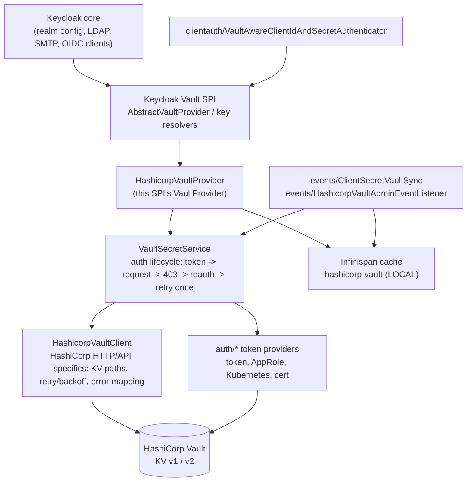

# Keycloak HashiCorp Vault SPI

*Disclaimer: This project is not affiliated with, endorsed by, or supported by Red Hat, Inc., the Keycloak project, or HashiCorp, Inc.*

This JAR is a Keycloak **Vault SPI** provider (`id=hashicorp`) for **Keycloak / Red Hat build of Keycloak 26.7.3**. Keycloak stores `${vault.key}` pointers; secret material remains in HashiCorp Vault KV.

It also:

* Resolves those pointers for **confidential client secrets** at token time using the vault-aware client authenticator.
* Writes a generated confidential-client secret to Vault on **client create** and **Regenerate secret**, then stores `${vault.{clientId}}` in Keycloak.

Do **not** set `--vault=file` or `--vault=keystore`. Select this provider with `--spi-vault--provider=hashicorp`.

## Supported version policy

| Scope | Version | Status |
|---|---|---|
| Compile-time dependency | Keycloak 26.7.3 | Authoritative Maven build target |
| Tested runtime | Keycloak 26.7.3 | Verified by the repository test suite and integration tests |
| Official support | Keycloak 26.7.3 | Supported baseline for this project |
| Historical compatibility note | 26.4.x | Legacy/compatibility-bridge only; not the supported baseline |

This project intentionally declares one supported baseline: Keycloak 26.7.3. Do not claim compatibility with a different Keycloak release unless it is explicitly re-tested in CI or a targeted runtime validation. The compatibility-sensitive dependencies remain documented in [KEYCLOAK_COMPATIBILITY.md](KEYCLOAK_COMPATIBILITY.md).

**Further reading:** [Keycloak version compatibility risks](KEYCLOAK_COMPATIBILITY.md) ·
[Installation guide](INSTALLATION.md) ·
[Configuration reference](CONFIGURATION.md) ·
[Security guidance](SECURITY.md) ·
[Operations guide](OPERATIONS.md) ·
[Integration test matrix](INTEGRATION_TEST_MATRIX.md) ·
[Upgrade notes](UPGRADING.md)

---

## Architecture

This SPI is deliberately layered so HashiCorp Vault's HTTP/API specifics never leak into
generic "get me a secret" call sites, and so the Keycloak-facing surface stays small:



| Layer | Class(es) | Responsibility |
|---|---|---|
| Keycloak SPI | `HashicorpVaultProvider`, `HashicorpVaultProviderFactory` | Implements Keycloak's `VaultProvider`/`VaultProviderFactory` contract; the only place that talks to Keycloak's key-resolver chain and config metadata. |
| Secret service | `VaultSecretService` | Generic secret lifecycle (read/write/delete) plus the **one** place the token-refresh-on-403 retry loop is implemented. Knows nothing about HTTP, JSON, or KV path shapes. |
| Secret-store abstraction | `HashicorpVaultClient.SecretLookup` / `WriteResult` / `DeleteResult` / `SecretMetadata` records, `VaultRetryPolicy`, `VaultErrorMapper`, `exception/*` | The status-code/typed-exception vocabulary the rest of the codebase (event listeners, client authenticator, health checker) is written against, independent of any single vendor's wire format. |
| HashiCorp Vault implementation | `HashicorpVaultClient`, `VaultPathResolver`, `auth/*` | Everything that is specifically HashiCorp's HTTP API: KV v1/v2 URL shapes, request/response envelopes, login payloads for each auth method, `X-Vault-Token`/`X-Vault-Namespace` headers. |

`VaultSecretService` and the secret-store abstraction (records + `VaultRetryPolicy` +
`VaultErrorMapper` + `exception/*`) have **no import of anything Vault-specific in name**
beyond the class names themselves — they operate purely on status codes, typed exceptions,
and plain strings, so a second secret-store backend would only require a second
implementation of the same `HashicorpVaultClient`-shaped surface, not changes to
`VaultSecretService`, the event listeners, or the client authenticator. See the
[OpenBao assessment](OPENBAO_ASSESSMENT.md) for why this project does not add a second
backend today. Additional layering beyond this (for example a generic `SecretStore`
interface with only one real implementation) was deliberately not introduced — it would add
indirection without a second consumer to justify it.

---

## What this SPI does

### Components Keycloak already provides (reused, not replaced)

| Keycloak component | How this SPI uses it |
|---|---|
| Vault SPI (`AbstractVaultProvider` / `AbstractVaultProviderFactory`) | `${vault.key}` lookup, key resolvers |
| `SimpleHttp` / `HttpClientProvider` | All outbound HTTP to Vault (no private HTTP client) |
| Infinispan embedded cache manager | LOCAL cache `hashicorp-vault` for KV values |
| `client-secret` authenticator | Replaced with a higher-`order()` factory of the same id so token requests resolve `${vault.key}` |
| Admin events | Global listener `hashicorp-vault` writes generated client secrets and invalidates cache |

The JAR does **not** bundle Keycloak, Infinispan, or a HashiCorp SDK. Those APIs are `provided` at compile time and come from the Keycloak server at runtime.

### Lookup (read)

Admin fields store a pointer, not the secret:

```text
${vault.xyz}
```

Keycloak resolvers turn that into a Vault path. With `key-resolvers=REALM_FILESEPARATOR_KEY` (recommended for realm folders):

| Realm | Expression | KV v2 path | Field |
|---|---|---|---|
| `demo` | `${vault.xyz}` | `{url}/v1/secret/data/demo/xyz` | `value` (default) |

Default resolver `REALM_UNDERSCORE_KEY` would use `secret/data/demo_xyz` instead.

Request shape:

```text
GET {url}/v1/{kv-mount}/data/{resolvedKey}     # kv-version=2
GET {url}/v1/{kv-mount}/{resolvedKey}        # kv-version=1
Header: X-Vault-Token
Header: X-Vault-Namespace                     # only if namespace is set
Read:   data.data.{kv-field}                  # KV v2; default field "value"
```

LDAP bind credential, SMTP password, and identity-provider client secret are **read-only**: put the secret in Vault first, then set the Keycloak field to `${vault.key}`.

### Confidential clients (read + write)

1. Create a confidential client (Client authentication ON), or click **Regenerate secret**.
2. Keycloak generates a secret.
3. This SPI `PUT`s `{kv-mount}/data/{realm}/{clientId}` (with `REALM_FILESEPARATOR_KEY`) field `value`.
4. Keycloak stores `${vault.{clientId}}`.
5. Token requests send the **real** secret. The vault-aware `client-secret` authenticator resolves the pointer and compares.

When the client is deleted, this SPI deletes the corresponding managed Vault entry as well. KV v2 deletion removes all versions through the metadata endpoint. A missing entry is treated as already deleted; manually managed Vault entries are not touched.

If the Vault write fails, the generated secret stays in Keycloak.

The Admin Console Credentials tab still shows the newly generated secret **once** (POST response). Leave the client and open it again: the stored value should be `${vault.xyz}`.

---

# 1. Building this SPI

## Build-time dependencies

**Machine**

* JDK **17**
* Apache Maven **3.8+** (3.9 is fine)

**Maven compile dependencies** (`provided` — not packaged into the JAR)

| Artifact | Version | Why |
|---|---|---|
| `org.keycloak:keycloak-server-spi` | 26.4.7 | Vault SPI, `ClientModel`, `Config.Scope` |
| `org.keycloak:keycloak-server-spi-private` | 26.4.7 | `SimpleHttp`, admin events, private SPI |
| `org.keycloak:keycloak-services` | 26.4.7 | `AbstractVaultProvider*`, `ClientIdAndSecretAuthenticator` |
| `org.keycloak:keycloak-model-infinispan` | 26.4.7 | `InfinispanConnectionProvider`, cache config SPI |
| `org.jboss.logging:jboss-logging` | 3.5.0.Final | Logging |

**Test only:** `org.junit.jupiter:junit-jupiter` 5.10.2

There is **no** HashiCorp Java SDK, extra HTTP client, or extra JSON library. JSON uses Keycloak `JsonSerialization`.

## Build

```bash
mvn clean package
```

Artifact:

```text
target/keycloak-vault-integration-hashicorp-1.0.0.jar
```

Run tests without packaging:

```bash
mvn test
```

---

# 2. Deploying and configuring this SPI

## Runtime dependencies

Install these **before** this JAR can work:

| Component | Role | Notes |
|---|---|---|
| Keycloak **26.4.10** or RHBK **26.4.x** (tested **26.4.12**) | Host for the JAR | Java 17. Copy the JAR into **this** install’s `providers/`, not an older 26.0.x tree. |
| HashiCorp Vault (OSS or Enterprise) | Secret store | KV secrets engine v1 or v2 (v2 is the default in this SPI) |
| Network path Keycloak → Vault | HTTP(S) | Vault URL must be reachable from the Keycloak process |
| Vault auth credentials | Token, AppRole, or TLS cert | See [Authentication with HashiCorp](#authentication-with-hashicorp) |
| Vault Enterprise namespace | Optional isolation | Set SPI `namespace` if the cluster uses namespaces |

Do not run this JAR on Keycloak **26.0.x**. It uses `org.keycloak.http.simple.SimpleHttp` (26.4).

Do not point this JAR at a database that a **newer** Keycloak already migrated if you are still starting an older Keycloak.

## HashiCorp: what to do before integration

Do this on Vault **before** (or as the first step of) wiring Keycloak.

### 1. KV engine

This SPI defaults to mount `secret`, version **2**, field `value`.

```bash
# if KV v2 is not already at secret/
vault secrets enable -path=secret kv-v2
```

If you use another mount or KV v1, set `kv-mount` / `kv-version` on Keycloak to match.

### 2. Path layout (must match Keycloak resolvers)

With `--spi-vault--hashicorp--key-resolvers=REALM_FILESEPARATOR_KEY`:

```text
secret/data/{realm-name}/{vault-key}
```

Examples:

```bash
# LDAP bind in realm master, expression ${vault.ldapBc}
vault kv put secret/master/ldapBc value='bind-password'

# Confidential client xyz in realm demo, expression ${vault.xyz}
vault kv put secret/demo/xyz value='the-client-secret'
```

The field name must be the configured `kv-field` (default `value`). A field named after the client id (`abc=secret`) will **not** be read unless you set `kv-field=abc` (that field is then used for **every** secret).

LDAP / SMTP / IdP: create the KV entry **before** putting `${vault.key}` in Keycloak.

Confidential clients: this SPI can `PUT` the path for you on create/regenerate. The policy must still allow write.

### 3. Policy (least privilege, read and write for client secrets)

Prefer a **realm-scoped** policy over a wildcard across every realm. With `key-resolvers=REALM_FILESEPARATOR_KEY` each realm's secrets live under `secret/data/<realm>/...`, so a policy can be written per realm (or per tenant):

```hcl
# Read-only lookup, one realm only
path "secret/data/<realm>/*" {
  capabilities = ["read"]
}
```

For client create / regenerate (this SPI writes KV) in that same realm only:

```hcl
path "secret/data/<realm>/*" {
  capabilities = ["create", "update", "read"]
}

# optional, so operators can list that realm's folder
path "secret/metadata/<realm>/*" {
  capabilities = ["list"]
}
```

If `managed-secret-prefix` is set (see [Managed vs externally managed secrets](#managed-vs-externally-managed-secrets)), scope the write capability further to just that sub-path so this SPI can never write or delete outside its own namespace:

```hcl
path "secret/data/<realm>/<managed-secret-prefix>/*" {
  capabilities = ["create", "update", "read"]
}
path "secret/metadata/<realm>/<managed-secret-prefix>/*" {
  capabilities = ["read", "delete"]
}
```

Only fall back to a mount-wide policy (`path "secret/data/*" { capabilities = ["read"] }`) when a single Vault token must legitimately serve every realm (for example a shared AppRole used by all of a multi-realm Keycloak's realms) — this is a deliberate, documented trade-off, not the default recommendation. Substitute your own `kv-mount` if it is not `secret`. On Enterprise, create the policy **inside the namespace** Keycloak will use.

### 4. Authentication method on Vault

Enable **one** of token, AppRole, Kubernetes, or cert. Details are under [Authentication with HashiCorp](#authentication-with-hashicorp).

### 5. Namespace (Enterprise only)

If the customer isolates tenants with namespaces, create the namespace, enable KV and auth **in that namespace**, and put the same name in SPI `namespace` (for example `admin/team-a`). Nested namespaces use `parent/child`. Open-source Vault and the root namespace: leave `namespace` unset.

## Install the JAR on Keycloak

```bash
cp target/keycloak-vault-integration-hashicorp-1.0.0.jar "$KEYCLOAK_HOME/providers/"
"$KEYCLOAK_HOME/bin/kc.sh" build
```

Restart Keycloak after `build`. Copying the JAR without `kc.sh build` (except `start-dev`, which rebuilds) will not load the provider.

## Configuration rules

Keycloak maps SPI options itself. Do not invent extra environment variables.

| Source | Example |
|---|---|
| CLI (Keycloak **26.1+** / 26.4) | `--spi-vault--hashicorp--token=...` |
| Environment | `KC_SPI_VAULT__HASHICORP__TOKEN` |
| `conf/keycloak.conf` | `spi-vault--hashicorp--token=...` |

Keycloak **26.0** used single dashes (`--spi-vault-hashicorp-token`). This product targets **26.4** double dashes.

Always set the provider (mandatory):

```bash
--spi-vault--provider=hashicorp
```

## SPI options: mandatory vs optional

### Always required to use this product

| Option | CLI | Why |
|---|---|---|
| Vault provider id | `--spi-vault--provider=hashicorp` | Without this, Keycloak will not use this JAR as the vault |

### Required in practice (have defaults, must be correct for your site)

| Property | CLI | Default | Required? |
|---|---|---|---|
| `url` | `--spi-vault--hashicorp--url` | `http://127.0.0.1:8200` | **Required in production.** Default is only for local Vault. |
| `auth-method` | `--spi-vault--hashicorp--auth-method` | `token` | **Required to choose.** Values: `token`, `approle`, `kubernetes`, `cert` (aliases: `certificate`, `tls`, `tls-cert`). |

### Required depending on `auth-method`

| `auth-method` | Mandatory | Optional |
|---|---|---|
| `token` | `--spi-vault--hashicorp--token` | — |
| `approle` | `--spi-vault--hashicorp--approle-role-id` **and** `--spi-vault--hashicorp--approle-secret-id` | `--spi-vault--hashicorp--approle-mount-path` (default `approle`) |
| `kubernetes` | `--spi-vault--hashicorp--kubernetes-role` | `--spi-vault--hashicorp--kubernetes-mount-path` (default `kubernetes`), `--spi-vault--hashicorp--kubernetes-jwt-path` (default `/var/run/secrets/kubernetes.io/serviceaccount/token`) |
| `cert` | Keycloak outbound client keystore (see cert section). Vault must have `auth/cert` enabled and trust that certificate. | `--spi-vault--hashicorp--cert-name` (Vault cert role name), `--spi-vault--hashicorp--cert-mount-path` (default `cert`) |

If `auth-method=token` and `token` is empty, lookups fail (`Vault token is not configured`). If AppRole or Kubernetes configuration is missing, login fails explicitly (no fallback to another method, and **no static Vault token is required** for `approle` or `kubernetes`).

### Optional (safe defaults)

| Property | CLI | Default | When to set |
|---|---|---|---|
| `namespace` | `--spi-vault--hashicorp--namespace` | unset | **Required** on Vault Enterprise with namespaces. Omit for OSS / root. |
| `kv-mount` | `--spi-vault--hashicorp--kv-mount` | `secret` | If KV is not mounted at `secret` |
| `kv-version` | `--spi-vault--hashicorp--kv-version` | `2` | `1` only if the mount is KV v1 |
| `kv-field` | `--spi-vault--hashicorp--kv-field` | `value` | If secrets are not stored in field `value` |
| `key-resolvers` | `--spi-vault--hashicorp--key-resolvers` | `REALM_UNDERSCORE_KEY` | Set `REALM_FILESEPARATOR_KEY` for `{realm}/{key}` folders |
| `cache-ttl` | `--spi-vault--hashicorp--cache-ttl` | `300000` (ms) | `0` disables Infinispan caching |
| `cache-enabled` | `--spi-vault--hashicorp--cache-enabled` | `true` | Set `false` to disable cached reads regardless of TTL |
| `cache-max-entries` | `--spi-vault--hashicorp--cache-max-entries` | `10000` | Per-node bound for the local secret cache; takes effect when the cache is first created |
| `kv-read-version` | `--spi-vault--hashicorp--kv-read-version` | unset (latest) | Optional immutable KV v2 version to read; ignored for KV v1 |
| `managed-secret-prefix` | `--spi-vault--hashicorp--managed-secret-prefix` | unset | Set (for example `managed`) to isolate SPI-written confidential-client secrets under `<realm>/<prefix>/<clientId>`, see [Managed vs externally managed secrets](#managed-vs-externally-managed-secrets). Unset preserves the existing path. |

### Other Keycloak SPI used by this product (not this JAR’s properties)

| Purpose | Option | Required? |
|---|---|---|
| Outbound HTTPS to Vault (trust server cert) | Keycloak truststore, e.g. `https-trust-store-file` / `spi-truststore--file--file` | When Vault URL is `https://` with a private CA |
| Outbound mTLS for **cert** auth | `--spi-connections-http-client--default--client-keystore` and `--spi-connections-http-client--default--client-keystore-password` | **Mandatory for `auth-method=cert`** |
| Optional key password | `--spi-connections-http-client--default--client-key-password` | If the private key password differs |

That HTTP client keystore is **process-wide** (all Keycloak outbound HTTPS).

Do **not** set `--vault=file` or `--vault=keystore`. Those select a different vault provider.

## Cache, consistency, and rotation

Successful Vault field reads may be stored in Keycloak's existing embedded Infinispan cache named `hashicorp-vault`. The cache contains only the resolved field value; it never stores Vault tokens, metadata responses, failures, missing values, deleted versions, or destroyed versions. A cache entry has the configured `cache-ttl` lifespan and the cache has a configured `cache-max-entries` bound. Either `cache-enabled=false` or `cache-ttl=0` bypasses it completely.

Each entry uses a deterministic length-prefixed identity containing the Keycloak realm, KV mount, resolved Vault path, selected field, KV engine version, and requested KV v2 version (`latest` or a configured numeric version). Thus a lookup in one realm cannot satisfy the same path request in another realm, and a historical version cannot satisfy a latest-version lookup.

This integration intentionally uses a `LOCAL` cache on each Keycloak node. It does not configure a distributed, replicated, or invalidation cache and does not claim immediate cross-node invalidation. A successful SPI-managed client-secret write (including regenerate/rotation) and delete invalidate the precise local entry. Admin-event pointer changes do the same. Other nodes can retain the old value until their entry expires, they process a local invalidation event, or they restart. Choose a shorter TTL for faster rotation convergence, or disable caching where immediate Vault visibility outweighs request reduction.

For rotation, Keycloak generates a new client secret, the SPI writes it as a new KV v2 version, then invalidates the local cache. The next local read fetches the new Vault value. Old KV v2 versions are retained by Vault's configured retention policy; the SPI does not destroy them automatically. Client deletion uses the existing KV v2 metadata-delete behavior for the SPI-managed entry. Never rely on cache expiry as a rotation mechanism.

When Vault is unavailable, an unexpired local cache entry remains usable. A cache miss or expired entry follows the normal bounded Vault retry behavior and then fails closed. `404`, deleted versions, destroyed versions, missing fields, authorization failures, and transient failures are not negatively cached, so a later corrected Vault state is visible on the next read. Concurrent misses for the same deterministic cache key are coalesced per Keycloak node; unrelated secret paths do not block one another.

KV v2 reads default to the latest version. Set `kv-read-version=N` to read a fixed positive version through Vault's `GET .../data/<path>?version=N` API. The cache identity includes `N`. The client also exposes KV v2 metadata lookup for current version, creation time, deleted state, and destroyed state without returning, logging, or caching secret contents. KV v1 preserves its existing unversioned read/write behavior.

## Authentication with HashiCorp

Outbound HTTP always uses Keycloak `SimpleHttp`. After login, every KV call sends `X-Vault-Token`. If `namespace` is set, every call (including login) also sends `X-Vault-Namespace`.

AppRole and cert tokens are cached until 90% of `lease_duration`. HTTP 403 invalidates the cached token and retries login once. A static token is not renewed; rotate it in config and restart.

### A. Token (static)

**Vault**

```bash
vault policy write keycloak keycloak-policy.hcl
vault token create -policy=keycloak -ttl=768h
```

**Keycloak (mandatory: `provider`, `url` in production, `auth-method`, `token`)**

```bash
bin/kc.sh start \
  --spi-vault--provider=hashicorp \
  --spi-vault--hashicorp--url=https://vault.example.com:8200 \
  --spi-vault--hashicorp--auth-method=token \
  --spi-vault--hashicorp--token="$VAULT_TOKEN"
```

Optional: `--spi-vault--hashicorp--namespace=admin/team-a`

### B. AppRole

**Vault**

```bash
vault auth enable approle
vault write auth/approle/role/keycloak \
  token_policies=keycloak \
  token_ttl=1h \
  token_max_ttl=4h

vault read -field=role_id auth/approle/role/keycloak/role-id
vault write -field=secret_id -f auth/approle/role/keycloak/secret-id
```

If AppRole is enabled at another path, set `approle-mount-path`.

**Keycloak (mandatory: `approle-role-id`, `approle-secret-id`)**

```bash
bin/kc.sh start \
  --spi-vault--provider=hashicorp \
  --spi-vault--hashicorp--url=https://vault.example.com:8200 \
  --spi-vault--hashicorp--auth-method=approle \
  --spi-vault--hashicorp--approle-role-id="$ROLE_ID" \
  --spi-vault--hashicorp--approle-secret-id="$SECRET_ID"
```

Optional: `--spi-vault--hashicorp--approle-mount-path=approle`, `--spi-vault--hashicorp--namespace=...`

Login used by this SPI: `POST {url}/v1/auth/{mount}/login` with `role_id` and `secret_id`.

### C. Kubernetes

Vault authenticates the pod's projected service-account JWT against the Kubernetes API. This SPI reads the JWT from disk **fresh for every login attempt**; it is never cached in memory beyond that single call, never persisted, and never logged.

**Vault**

```bash
vault auth enable kubernetes
vault write auth/kubernetes/config \
  kubernetes_host="https://$KUBERNETES_SERVICE_HOST:$KUBERNETES_SERVICE_PORT"

vault write auth/kubernetes/role/keycloak \
  bound_service_account_names=keycloak \
  bound_service_account_namespaces=keycloak \
  policies=keycloak \
  ttl=1h
```

**Keycloak (mandatory: `kubernetes-role`; optional: `kubernetes-mount-path`, `kubernetes-jwt-path`)**

```bash
bin/kc.sh start \
  --spi-vault--provider=hashicorp \
  --spi-vault--hashicorp--url=https://vault.example.com:8200 \
  --spi-vault--hashicorp--auth-method=kubernetes \
  --spi-vault--hashicorp--kubernetes-role=keycloak \
  --spi-vault--hashicorp--kubernetes-mount-path=kubernetes \
  --spi-vault--hashicorp--kubernetes-jwt-path=/var/run/secrets/kubernetes.io/serviceaccount/token
```

Login used by this SPI: `POST {url}/v1/auth/{kubernetes-mount-path}/login` with body `{"role": "<kubernetes-role>", "jwt": "<service-account-jwt>"}`. No `--spi-vault--hashicorp--token` is required or read when `auth-method=kubernetes`. A missing/empty/unreadable JWT file, a missing role, or a Vault-side rejection all fail the login explicitly (return no token) instead of retrying indefinitely; the calling vault lookup then fails closed rather than falling back to another auth method.

### D. TLS / certificate

Vault cert auth is **mTLS**, not a PEM pasted into this SPI. Keycloak’s outbound HTTP client presents the client certificate. This SPI then `POST`s `{url}/v1/auth/{cert-mount}/login` (optional JSON `{"name":"<cert-name>"}`) and caches `auth.client_token`.

**Vault**

```bash
vault auth enable cert
vault write auth/cert/certs/keycloak \
  display_name=keycloak \
  policies=keycloak \
  certificate=@keycloak-client.crt \
  ttl=1h
```

The certificate in that command must match the one in Keycloak’s `client-keystore`.

**Keycloak (mandatory: HTTP client keystore; optional: `cert-name`, `cert-mount-path`)**

```bash
bin/kc.sh start \
  --spi-connections-http-client--default--client-keystore=/path/to/vault-client.p12 \
  --spi-connections-http-client--default--client-keystore-password="$KEYSTORE_PASSWORD" \
  --spi-vault--provider=hashicorp \
  --spi-vault--hashicorp--url=https://vault.example.com:8200 \
  --spi-vault--hashicorp--auth-method=cert \
  --spi-vault--hashicorp--cert-name=keycloak
```

`auth-method` may be `cert`, `certificate`, `tls`, or `tls-cert`. Trust Vault’s server certificate with Keycloak’s truststore.

## Managed vs externally managed secrets

Secrets in Vault fall into two categories:

* **Managed** — confidential-client secrets this SPI itself writes on client create/regenerate and removes on client delete.
* **Externally managed** — anything an operator puts in Vault directly (LDAP bind password, SMTP password, IdP client secret, or a confidential-client secret an operator chose to manage by hand).

By default (`managed-secret-prefix` unset) managed secrets share the same `<realm>/<clientId>` path as before, for backward compatibility. Setting `--spi-vault--hashicorp--managed-secret-prefix=managed` moves every managed secret this SPI writes or deletes to an explicit, separate namespace:

```text
secret/data/<realm>/managed/<clientId>
```

This SPI never deletes a Vault entry unless: (1) the corresponding Keycloak client's stored secret is still the exact `${vault.<clientId>}` pointer this SPI wrote, and (2) the resolved path passes `VaultPathResolver` validation. An operator-managed secret at any other path, or a path an admin has since repointed by hand, is left untouched. Migrating an existing deployment to `managed-secret-prefix` does not move already-written secrets — write (or let a secret regenerate) once after changing the setting so the new path is populated, and manually remove the old-path entry if it is no longer needed.

## Full start examples

**26.4 `start` with token + realm folders + namespace**

```bash
bin/kc.sh start \
  --spi-vault--provider=hashicorp \
  --spi-vault--hashicorp--url=https://vault.example.com:8200 \
  --spi-vault--hashicorp--namespace=admin/team-a \
  --spi-vault--hashicorp--auth-method=token \
  --spi-vault--hashicorp--token="$VAULT_TOKEN" \
  --spi-vault--hashicorp--key-resolvers=REALM_FILESEPARATOR_KEY
```

**Local `start-dev` (same flags, one line)**

```bash
bin/kc.sh start-dev --spi-vault--provider=hashicorp --spi-vault--hashicorp--url=http://127.0.0.1:8200 --spi-vault--hashicorp--auth-method=token --spi-vault--hashicorp--token="$VAULT_TOKEN" --spi-vault--hashicorp--key-resolvers=REALM_FILESEPARATOR_KEY
```

Put every flag on **one** command. A newline without `\` starts a second shell command; `token` will not reach Java.

Same values in `conf/keycloak.conf`:

```properties
spi-vault--provider=hashicorp
spi-vault--hashicorp--url=https://vault.example.com:8200
spi-vault--hashicorp--auth-method=token
spi-vault--hashicorp--token=${VAULT_TOKEN}
spi-vault--hashicorp--key-resolvers=REALM_FILESEPARATOR_KEY
```

## Sample test scenario (curl)

Assumes: Vault at `http://127.0.0.1:8200`, Keycloak at `http://localhost:8080`, realm `demo`, confidential client `xyz`, user `hexecho` with password `secret`, Direct access grants enabled, resolver `REALM_FILESEPARATOR_KEY`, KV field `value`.

### 1. Vault

```bash
export VAULT_ADDR=http://127.0.0.1:8200
vault kv put secret/demo/xyz value='secret'
vault kv get secret/demo/xyz
```

### 2. Keycloak client pointer (if you did not rely on auto-write)

```bash
# replace the UUID with the client’s id from the Admin Console or kcadm
./kcadm.sh config credentials --server http://localhost:8080 --realm master --user admin
./kcadm.sh update clients/<CLIENT_UUID> -r demo -s 'secret=${vault.xyz}'
```

Do not click **Regenerate secret** if you only want to keep a hand-written pointer; regenerate **overwrites** Vault with a new value and then stores `${vault.xyz}` again.

### 3. Token request (send the real secret, not the pointer)

```bash
curl -s http://localhost:8080/realms/demo/protocol/openid-connect/token \
  -d grant_type=password \
  -d client_id=xyz \
  -d client_secret=secret \
  -d username=hexecho \
  -d password=secret
```

A successful body contains `access_token`. Failure `unauthorized_client` / `invalid_client_credentials` means the presented secret did not match Vault `value` (or the pointer was not resolved).

### 4. Auto-write on create

Create a confidential client `cdf` in realm `demo` with Client authentication ON. Then:

```bash
vault kv get secret/demo/cdf
```

You should see field `value`. In Keycloak, after leaving and reopening the client, the secret field should be `${vault.cdf}`.

Repeat the curl from step 3 with `client_id=cdf` and `client_secret` equal to that Vault `value`.

### 5. LDAP / SMTP / IdP (read-only)

```bash
vault kv put secret/demo/ldapBc value='bind-password'
```

Set the LDAP bind credential to `${vault.ldapBc}`. There is no write-back for LDAP/SMTP/IdP.

## After deploy: Keycloak realm settings

* Copy the JAR, `kc.sh build`, restart with `--spi-vault--provider=hashicorp` and a complete auth set.
* Boot log should show `HashiCorp vault provider initialized` and **must not** say `Vault token is not configured` when using `auth-method=token`.
* Listener id `hashicorp-vault` is **global** (regenerate works without adding it under Realm Settings → Events). You may still add it there if you want it listed.
* Direct access grants must be on for the password-grant curl sample.
* Do not use **Regenerate secret** expecting the old Vault value to remain; regenerate writes a new secret to Vault.

## Kubernetes deployment example

Minimal Keycloak `Deployment` snippet using Kubernetes auth (no static token or secret-id
stored in the manifest); adjust image, resources, and probes for production use.

```yaml
apiVersion: apps/v1
kind: Deployment
metadata:
  name: keycloak
spec:
  replicas: 2
  selector:
    matchLabels: { app: keycloak }
  template:
    metadata:
      labels: { app: keycloak }
    spec:
      serviceAccountName: keycloak
      containers:
        - name: keycloak
          image: quay.io/keycloak/keycloak:26.4.10
          args: ["start", "--optimized"]
          env:
            - name: KC_SPI_VAULT__PROVIDER
              value: hashicorp
            - name: KC_SPI_VAULT__HASHICORP__URL
              value: https://vault.vault.svc:8200
            - name: KC_SPI_VAULT__HASHICORP__AUTH_METHOD
              value: kubernetes
            - name: KC_SPI_VAULT__HASHICORP__KUBERNETES_ROLE
              value: keycloak
            - name: KC_SPI_VAULT__HASHICORP__KEY_RESOLVERS
              value: REALM_FILESEPARATOR_KEY
          volumeMounts:
            - name: kc-truststore
              mountPath: /opt/keycloak/conf/truststores
              readOnly: true
      volumes:
        - name: kc-truststore
          secret:
            secretName: vault-ca-truststore
```

Matching Vault-side setup (run once by a Vault administrator, not by Keycloak):

```bash
vault write auth/kubernetes/role/keycloak \
  bound_service_account_names=keycloak \
  bound_service_account_namespaces=keycloak \
  policies=keycloak \
  ttl=1h
```

The `keycloak` ServiceAccount's projected token is what Vault validates; no Vault
credential is ever stored in the Kubernetes manifest, a Secret, or a ConfigMap.

## Security

**What this SPI stores where:**

| Data | Stored in Keycloak | Stored in Vault |
|---|---|---|
| Confidential client secret (value) | Never (only the `${vault.{clientId}}` pointer) | Yes, KV field `kv-field` |
| LDAP bind / SMTP / IdP client secret (value) | Never (operator sets `${vault.key}`) | Yes (operator-managed) |
| Vault token / AppRole secret-id / Kubernetes JWT | Static token or AppRole values only if configured via SPI properties (Keycloak's own config store, e.g. `keycloak.conf` or env) | N/A — these authenticate *to* Vault, they are not secrets Vault stores for this SPI |
| Cached secret value | In-process Infinispan `LOCAL` cache only, bounded TTL, never persisted to disk | N/A |

**Least privilege.** Scope the Vault policy to the minimum paths this SPI needs — see
[Policy (least privilege, read and write for client secrets)](#3-policy-least-privilege-read-and-write-for-client-secrets).
Prefer a realm-scoped policy over a mount-wide wildcard; prefer `managed-secret-prefix` so
this SPI's write/delete capability is scoped to a sub-path it exclusively owns (see
[Managed vs externally managed secrets](#managed-vs-externally-managed-secrets)).

**Realm isolation.** Every cache key and, with `key-resolvers=REALM_FILESEPARATOR_KEY`,
every Vault path includes the realm name, so one realm's Vault token or cache entry cannot
satisfy another realm's lookup (`HashicorpVaultCacheKeyTest`, `VaultPathResolverTest`).
Realm isolation at the Vault-policy level (a distinct AppRole/token per realm) is an
operator responsibility this SPI supports but does not enforce — a single shared credential
used across realms can read/write every realm's secrets unless Vault policy scopes it.

**TLS.** Always deploy with `https://` to Vault in production; set the Keycloak truststore
that trusts Vault's server certificate. For `auth-method=cert`, the client certificate lives
in Keycloak's own outbound HTTP client keystore (`--spi-connections-http-client--default--client-keystore`),
never in this SPI's configuration, so it benefits from Keycloak's existing keystore rotation
and protection.

**Kubernetes authentication.** The service-account JWT is read from disk fresh for every
login attempt, never cached in memory beyond that single call, never logged, and never
included in an exception message (`KubernetesTokenProvider`).

**Secret handling in memory.** Secret values pass through as `String`s returned by Jackson
and Keycloak's own `VaultRawSecret`/`DefaultVaultRawSecret` types; this SPI does not add its
own additional in-memory copies, temp files, or disk-backed caches beyond the bounded
Infinispan entry.

**Logging restrictions.** See [Observability](#observability) below for the explicit list of
what must never appear in a log line.

**Secret rotation.** See [Cache, consistency, and rotation](#cache-consistency-and-rotation).
Rotation always writes a **new** Vault value before Keycloak's UI shows the client secret
again; a failed Vault write leaves the previously generated secret in Keycloak rather than
silently losing it.

## Observability

**Available logs** (all via `org.jboss.logging.Logger`, so they follow Keycloak's own log
level/handler configuration):

| Logger | Emits |
|---|---|
| `HashicorpVaultProviderFactory` | Provider init summary (auth method, URL, namespace, KV mount/version, timeouts, retry budget, health-check state) — no secret values |
| `HashicorpVaultClient` | Per-request retry/backoff attempts, final failure classification (`VaultErrorMapper` reason), health-check poll results |
| `VaultSecretService` | Re-authentication after a 403, with outcome (refreshed vs. still unusable) |
| `auth/*TokenProvider` | Login attempts, missing-config warnings (e.g. missing `kubernetes-role`), JWT-file read failures (path only, never JWT content) |
| `events/ClientSecretVaultSync`, `events/HashicorpVaultAdminEventListener` | Write-back attempts, cache invalidation on rotate/delete |
| `VaultHealthChecker` | Background health-check transitions (healthy ↔ unhealthy) |

**Safe diagnostic information** — realm name, Vault path (mount/realm/key segments only,
never combined with the secret value), HTTP status code, operation name (`read-secret`,
`write-secret`, `delete-secret`, `authenticate`), exception class name, attempt number,
duration in milliseconds.

**Error categories** (see `exception/*` and `VaultErrorMapper`): `VaultConfigurationException`
(400 / bad config, never retried), `VaultAuthenticationException` (401 or failed login),
`VaultAuthorizationException` (403), `VaultSecretNotFoundException` (404), `VaultRateLimitException`
(429, retried), `VaultServerException` (5xx, retried), `VaultConnectionException` /
`VaultTimeoutException` (transport-level, retried per `VaultRetryPolicy`).

**Vault health.** Optional background poll of `GET /v1/sys/health` (`health-check-enabled=true`),
logged at INFO on success and WARN on failure/unhealthy status; never on the secret-lookup
hot path.

**Retry events.** Every retry attempt is logged at WARN with the operation, path, status or
transport-error class, attempt number out of the configured maximum, and duration —
sufficient to build an alert on sustained retry storms without exposing secret data.

**Authentication failures.** Failed logins are logged with the auth method and Vault's HTTP
status, never with the token, AppRole secret-id, JWT, or client certificate/key material.

**Must NEVER appear in logs** (verified by code review of every log call site in this
codebase): Vault tokens (`X-Vault-Token` value), AppRole `secret_id`, Kubernetes service
account JWTs, TLS client private keys, resolved secret **values** (only the Vault *path* is
logged, per `HashicorpVaultClient.safePath`), and full Vault HTTP response bodies (only the
parsed status/field-presence outcome is logged, never the raw body).

## Troubleshooting

| Symptom | Likely cause | Fix |
|---|---|---|
| Boot log: `Vault token is not configured` | `auth-method=token` with no `token` set | Set `--spi-vault--hashicorp--token` |
| Boot fails: `Vault url '...' must use the http or https scheme` / `must include a host` | Malformed `url` (typo, missing scheme, missing host) | Correct the `url` property; only `http://`/`https://` with a host are accepted |
| Boot fails: `auth-method=approle requires both approle-role-id and approle-secret-id to be set` | AppRole selected without both credentials | Set both `approle-role-id` and `approle-secret-id` |
| Boot fails: `auth-method=kubernetes requires kubernetes-role to be set` | Kubernetes auth selected without a role | Set `kubernetes-role` |
| Token request returns `unauthorized_client` / `invalid_client_credentials` | Presented secret does not match the Vault value, or the pointer did not resolve | Confirm the Vault KV field equals what you POST as `client_secret`; confirm `key-resolvers` matches how the secret was written |
| `Vault secret lookup failed: authorization denied` (403) in logs | Vault policy does not grant `read` on the resolved path | Check the policy against the *resolved* path (`kv-mount/data/{resolvedKey}` for KV v2), not the `${vault.key}` expression |
| Regenerate secret does not update Vault | Vault write failed (check for a preceding WARN); Keycloak keeps the previously generated secret in that case | Check Vault write policy/connectivity, then regenerate again |
| Stale secret value served after rotation on some Keycloak nodes | Expected `LOCAL` cache behavior — other nodes have not expired/invalidated yet | Lower `cache-ttl` for faster convergence, or disable caching where immediate visibility is required |
| Requests hang / time out slowly | `connect-timeout-ms` / `read-timeout-ms` too high for the environment | Lower the timeouts; confirm network path to Vault |
| Frequent `VaultServerException` retries in logs | Vault under load or partially unavailable | Check Vault's own health/logs; consider `retry-max-attempts` / backoff tuning |
| JAR loads but nothing happens | Missing `--spi-vault--provider=hashicorp`, or `--vault=file`/`--vault=keystore` set instead | Set `--spi-vault--provider=hashicorp` and remove any `--vault=...` flag |
| `NoClassDefFoundError` for `org.keycloak.http.simple.SimpleHttp` | JAR deployed on Keycloak 26.0.x (package does not exist there) | Deploy on Keycloak 26.4.x+; see [Keycloak compatibility risks](KEYCLOAK_COMPATIBILITY.md) |

## Testing and CI

* `mvn test` — unit tests only (100+ tests, no Docker required); this is what CI runs on
  every push/PR as a fast gate.
* `mvn verify` — unit tests **and** the Testcontainers integration suite
  (`VaultContainerIT`) against a real `hashicorp/vault` dev-mode container: KV v1/v2,
  token/AppRole login, secret rotation, retry-through-outage, and connect-timeout behavior.
  Requires Docker; the suite skips itself automatically when Docker is unavailable so it
  never breaks a Docker-less environment.
* See [.github/workflows/ci.yml](.github/workflows/ci.yml) for the CI pipeline (compile →
  unit test → package as one job, integration test as a second job) and
  [INTEGRATION_TEST_MATRIX.md](INTEGRATION_TEST_MATRIX.md) for exactly which scenario is
  covered where and why.

## License

Apache License 2.0.
